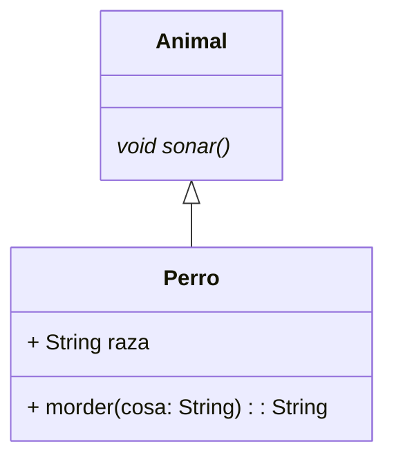

# Diagrama de clases

## Animales

El siguiente diagrama representa la estructura de clases de los tipos de animales de la aplicacion


```java
class Perro extends Animal{
  
  String raza;
  
  String morder(String cosa){
    
    return null;
    
  }
  
  @Override
  void sonar(){
  
    return null;
  
  }

}

abstract classs Animal{

  void alimentar(){
  
  }

  abstract void sonar();

}

```


